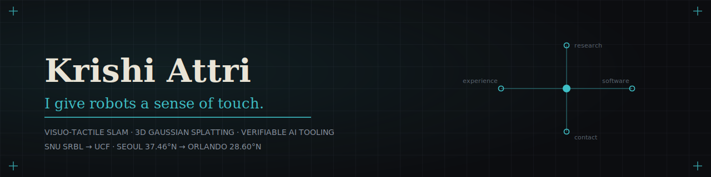

  

  
  
  
  

  

  Robotics and AI. I build research systems that ship as real, installable libraries: visuo-tactile perception, 3D Gaussian splatting, and tooling that makes AI <b>verifiable</b> instead of plausible.

  
  
  

---

## ▌ Live dashboard

<!--
  EVERY number on this page is live. There are no hand-maintained figures anywhere
  in this README: the cards below are rendered on each page view from the GitHub API,
  and the per-package version / downloads / star badges in the Shipped table are live
  shields. (GitHub proxies and caches README images, so a value can lag a little before
  it catches up; it always converges.) Theme: teal #3ebfc6 / carbon #0C0D10 / grey #8a93a0.
-->

  Pulled live from the GitHub API on every visit: stars, commits, PRs, contributions, streak, languages, plus each package's version and downloads below. Nothing here is hand-edited.

<table align="center" border="0" cellspacing="0" cellpadding="0"><tr>
<td valign="top" width="50%">

</td>
<td valign="top" width="50%">

</td>
</tr></table>

  

  

## ▌ Shipped

> Research that ends as something you can `pip install`, cite by DOI, and reproduce. Every badge below is live: version, downloads/month, and stars update straight from PyPI and the GitHub API.

| project | what it does |
|---|---|
| 🧩 [**splatreg**](https://github.com/Archerkattri/splatreg)        | Register Gaussian splats: align and merge two 3DGS scans into one SE(3)/Sim(3) frame, recover scale, dedupe the overlap. CLI plus a pure-PyTorch API. [Docs.](https://archerkattri.github.io/splatreg/) |
| 📐 [**mathlas**](https://github.com/Archerkattri/mathlas)        | Airtight math an AI *uses* over MCP: theorem search, PSLQ constant ID, OEIS, **real Lean kernel checks**, applicability checklists. No LLM inside, no API key. `claude mcp add mathlas -- uvx mathlas-mcp` |
| ⚡ [**HiCache++**](https://github.com/Archerkattri/hicache-plus-plus)        | Training-free diffusion acceleration by **exponential** (Dynamic-Mode-Decomposition / Prony) feature forecasting: a drop-in basis upgrade to TaylorSeer/HiCache, plus a holdout `auto` mode that cannot make things worse. |
| 🛣️ [**CERT-FLOW**](https://github.com/Archerkattri/CERT-FLOW)        | Certified route planning under drifting costs: every replanning round emits a conformal certificate **LB ≤ OPT ≤ UB** on the optimal route, directs paid sensing at the edges that shrink the certified gap fastest, and proof-gates the fast preprocessing. |

⚙️ <b>The acceleration adapter family</b> : HiCache / HiCache++ on real 3D generators

 

| model | Hermite (HiCache) | DMD (HiCache++) |
|---|---|---|
| TRELLIS v1 | [faster-trellis](https://github.com/Archerkattri/faster-trellis) | [faster-trellis-plus-plus](https://github.com/Archerkattri/faster-trellis-plus-plus) |
| TRELLIS.2-4B | [hermit-trellis2](https://github.com/Archerkattri/hermit-trellis2) · [fast-trellis2](https://github.com/Archerkattri/fast-trellis2) | [hermit-trellis2-plus-plus](https://github.com/Archerkattri/hermit-trellis2-plus-plus) |
| Hunyuan3D-2 mini | [hunyuan2-plus](https://github.com/Archerkattri/hunyuan2-plus) | [hunyuan2-plus-plus](https://github.com/Archerkattri/hunyuan2-plus-plus) |
| Hunyuan3D-2.1 | [hunyuan2.1-plus](https://github.com/Archerkattri/hunyuan2.1-plus) | [hunyuan2.1-plus-plus](https://github.com/Archerkattri/hunyuan2.1-plus-plus) |
| SAM 3D Objects | [sam3d-plus](https://github.com/Archerkattri/sam3d-plus) | [sam3d-plus-plus](https://github.com/Archerkattri/sam3d-plus-plus) |
| Fast-SAM3D | [fastsam3d-plus](https://github.com/Archerkattri/fastsam3d-plus) | [fastsam3d-plus-plus](https://github.com/Archerkattri/fastsam3d-plus-plus) |

ComfyUI nodes: [ComfyUI-HiCache](https://github.com/Archerkattri/ComfyUI-HiCache) · [ComfyUI-TRELLIS-HiCache](https://github.com/Archerkattri/ComfyUI-TRELLIS-HiCache) · [ComfyUI-TRELLIS2-HiCache](https://github.com/Archerkattri/ComfyUI-TRELLIS2-HiCache)

## ▌ In the lab

🫳 **GaussianFeels** : real-time visuo-tactile 3D-Gaussian SLAM for in-hand manipulation. One object-centric Gaussian map serves tracking, reconstruction, rendering, and manipulation-facing geometry at once, fast enough to close the loop and holding up from simulation onto real hardware. M.S. thesis at the SNU Soft Robotics and Bionics Lab, release upcoming.

## ▌ Stack

  
  
  
  
  
  
  
  
  

---

  
    <a href="https://archerkattri.github.io">portfolio</a> ·
    <a href="https://archerkattri.github.io/splatreg/">splatreg docs</a> ·
    <a href="https://glama.ai/mcp/servers/Archerkattri/mathlas">mathlas on Glama</a> ·
    <a href="https://www.linkedin.com/in/krishi-attri15/">linkedin</a>
  

<i>I build the system, then I make it prove it works.</i>

